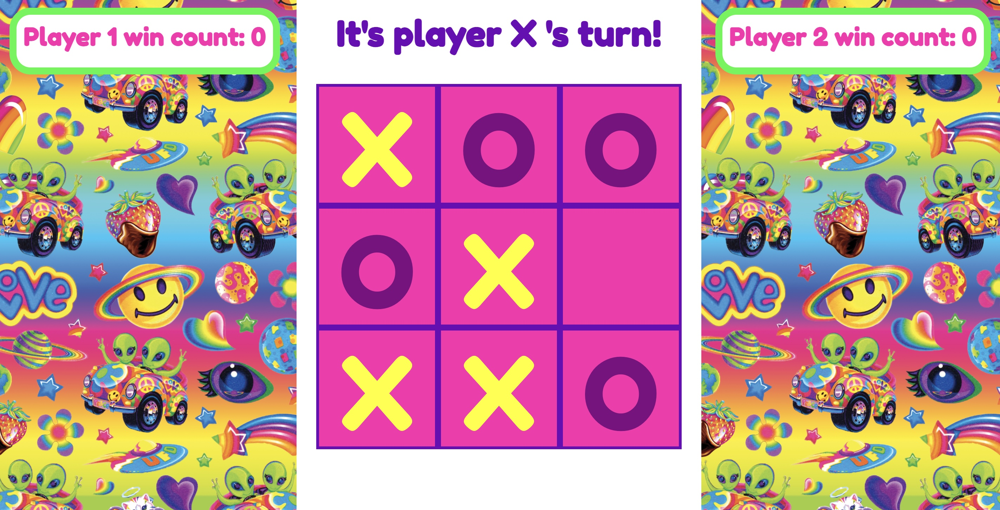
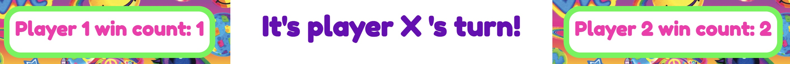

# Tic-Tac-Toe

## Table of Contents
- [Introduction](#introduction)
- [Goals](#goals)
- [Technologies](#technologies)
- [Set Up](#set-up)
- [Features](#features)
- [Reflection](#reflection)
- [Future Features](#future-features)
- [Contributors](#contributors)

### Introduction
This is a tic-tac-toe game for you to enjoy! Play tic-tac-toe and win, lose, or draw. Enjoy!

### Goals
The main goals of this project were to create a functional, interactive tic-tac-toe game using HTML, CSS, and JavaScript.

### Technologies
- JavaScript
- HTML
- CSS

### Set Up
1.  Clone this [repository](https://github.com/ASands17/Tic-Tac-Toe).
2. `cd` into the directory.
3. Run `open index.html`.

### Features
- Place a token by clicking on an empty grid on the tic-tac-toe board.

- Once a game is won or once there is a draw, the tic-tac-toe board resets so a new game can be started.

- Player wins are tracked even when the game resets.

### Reflection
- The most challenging part of this project was keeping the DOM and data model separate.
- I enjoyed learning about CSS animations during this project. I look forward to learning more about them in future projects.

### Future Features
- Fix display so that only win/draw status displays, and not player's turn.
- Add local storage so that wins persist even when page is closed.
- Add animation for winning match.

### Contributors
- [Amanda Sands](https://github.com/irmakerdem)
